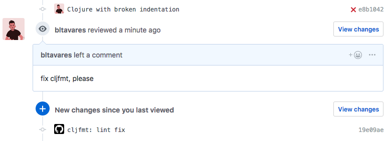
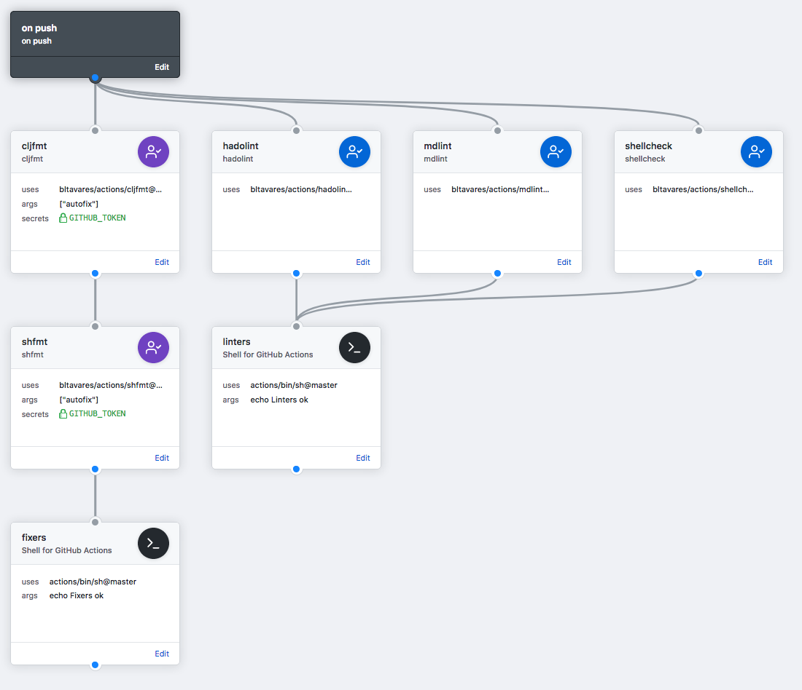
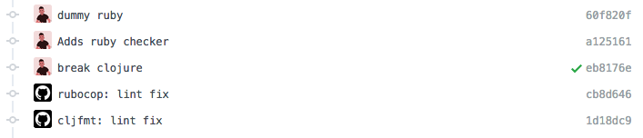

# Github Actions


Useful GitHub Actions to help build software.
Detailed documentation on how to use each action located on their folder.

## Provided actions

### Utilities

<!-- markdownlint-disable MD013 -->
| Action       | Description                                              |
|--------------|----------------------------------------------------------|
| [bash](bash) | Execute any shell command, with some utilities available |
<!-- markdownlint-enable MD013 -->

### Linters and Formatters

<!-- markdownlint-disable MD013 -->
| Action                       | Description                   | Lint on Push | Fix with Review   | Autofix on Push   |
|------------------------------|-------------------------------|--------------|-------------------|-------------------|
| [clippy](clippy)             | Rust linter                   | x            | x (Partial fixes) | x (Partial fixes) |
| [cljfmt](cljfmt)             | Clojure formatter             | x            | x                 | x                 |
| [dartfmt](dartfmt)           | Dart (and Flutter) formatter  | x            | x                 | x                 |
| [prettier](prettier)         | An opinionated code formatter | x            | x (Partial fixes) | x (Partial fixes) |
| [pwshfmt](pwshfmt)           | Powershell Formatter          | x            | x                 | x                 |
| [rubocop](rubocop)           | Ruby linter                   | x            | x                 | x                 |
| [rustfmt](rustfmt)           | Rust formatter                | x            | x                 | x                 |
| [shfmt](shfmt)               | Shell formatter               | x            | x                 | x                 |
| [terraform](terraform)       | Terraform linter              | x            | x                 | x                 |
| [tslint](tslint)             | TypeScript lint and formatter | x            | x                 | x                 |
| [zprint](zprint)             | Clojure formatter             | x            | x                 | x                 |
| [dartanalyzer](dartanalyzer) | Dart (and Flutter) linter     | x            |                   |                   |
| [hadolint](hadolint)         | Dockerfile linter             | x            |                   |                   |
| [kubeval](kubeval)           | Kubernets (k8s) linter        | x            |                   |                   |
| [mdlint](mdlint)             | Markdown linting              | x            |                   |                   |
| [shellcheck](shellcheck)     | Bash linter                   | x            |                   |                   |
| [markdownlint](markdownlint) | Markdown linter               | x            |                   |                   |
<!-- markdownlint-enable MD013 -->

#### Linters on push

Adding linters on the PR is as simple as adding an action to resolve on `push`.

Linters don't need access to `GITHUB_TOKEN`, but they might need extra secrets
and env-vars, depending on how the tool is used.

For example, `cljfmt` needs to be installed and setup on the project, as well as
any environment variable to access the project's dependencies. Meanwhile
,`shellcheck` needs no modification on the project to be adopted.

Check the documentation of the action to see if it is necessary to setup the
project before adoption.

Here is an example workflow:

```hcl
workflow "on push" {
  on = "push"
  resolves = ["shellcheck"]
}

action "shellcheck" {
  uses = "bltavares/actions/shellcheck@master"
}
```

#### Fixes by Review comments

It is possible to add linters which observe the Review comments and act upon
them. This uses the `pull_request_review` event, and it expects the `fix
<action>` as the content.

Given this workflow, you could trigger the fix as the following:

```hcl
workflow "on reviews" {
  on = "pull_request_review"
  resolves = ["cljfmt"]
}

action "cljfmt" {
  uses = "bltavares/actions/cljfmt@master"
  secrets = ["GITHUB_TOKEN"]
}
```



The event **only** works on Review comments, not on regular PR comments.

This is a limitation of the information provided on the event payload, which
Review comments are run on the PR context, while regular comments on the PR are
run pointing to `master`, with no reference to the branch being discussed.

_(So far I'm not aware how to make it work for both scenarios with the
information provided)_

#### Autofixing

It is possible to add linters which will automatically fix itself. It does so by
using the underlying autofix, commiting and running the lints right after.

Running a second time allows the check to validate if the automatic changes
fixed all the warnings, as some warnings cannot be automated by the underlying
tool.

Autofixing can be enabled by passing the `autofix` argument using `args = ["autofix"]`.
By default the github `push` event is used.

```hcl
workflow "on reviews" {
  on = "pull_request_review"
  resolves = ["shfmt"]
}

action "shfmt" {
  uses = "bltavares/actions/shfmt@master"
  args = ["autofix"]
  secrets = ["GITHUB_TOKEN"]
}
```

The github event can be configured via the `AUTOFIX_EVENTS` env variable.
Following example uses the `pull_request` event, instead of `push`.

```hcl
workflow "on reviews" {
  on = "pull_request_review"
  resolves = ["shfmt"]
}

action "shfmt" {
  uses = "bltavares/actions/shfmt@master"
  args = ["autofix"]
  env = {
    AUTOFIX_EVENTS="pull_request|push"
  }
  secrets = ["GITHUB_TOKEN"]
  needs = ["action-filter"]
}

action "action-filter" {
  uses = "actions/bin/filter@master"
  args = "action 'opened|ready_for_review|synchronize'"
}
```

As the `pull_request` event is rather chatty it is recommended to apply action filters.

##### :warning: Caveats

Autofixes requires a certain level of coordination when building the workflow.
Given that each action runes and modify the code, they need to be sequential,
otherwise a data race might lead to lost commits.

The _autofixers_ might run in parallel of other linters, but not in parallel of
other autofixers.

Here is an example of how to chain fixers on a workflow, while still having
parallel linters running.

```hcl
workflow "on push" {
  on = "push"
  resolves = ["linters", "autofixers"]
}

action "linters" {
  needs = ["mdlint", "shellcheck"]
  uses = "actions/bin/sh@master"
  args = ["echo Linters ok"]
}

action "autofixers" {
  needs = ["shfmt", "cljfmt"]
  uses = "actions/bin/sh@master"
  args = ["echo Fixers ok"]
}

action "shfmt" {
  uses = "bltavares/actions/shfmt@master"
  args = ["autofix"]
  secrets = ["GITHUB_TOKEN"]
  needs = ["cljfmt"]
}

action "cljfmt" {
  uses = "bltavares/actions/cljfmt@master"
  args = ["autofix"]
  secrets = ["GITHUB_TOKEN"]
}

action "mdlint" {
  uses = "bltavares/actions/mdlint@master"
}

action "shellcheck" {
  uses = "bltavares/actions/shellcheck@master"
}
```

This would generate the following pipeline:



And would result on the following example on pushes:



You may validate the ordering of fixers using `act -l` locally, provided by
[nektos/act](https://github.com/nektos/act).

#### Restricting execution of autofixers on push

Autofixers listening to `push` events will execute both on pull requests,
as well as commits pointing to master. If there is no restriction, on master commits
the autofixers will also commit the changes to master.

This might not be the workflow you are looking for. You may use
[actions/bin/filter](https://github.com/actions/bin/tree/master/filter) to restrict
wheter autofixers should run or not, leveraing the [ref filter](https://github.com/actions/bin/tree/master/filter#ref)
and [branch filter](https://github.com/actions/bin/tree/master/filter#branch)

Here is one example, using autofixers only on PRs, while using them as linters
on master.

```hcl
workflow "on push" {
  on = "push"
  resolves = ["linters", "autofixers"]
}

action "linters" {
  needs = ["mdlint", "shellcheck", "shfmt-lint", "cljfmt-lint"]
  uses = "actions/bin/sh@master"
  args = ["echo Linters ok"]
}

action "autofixers" {
  needs = ["shfmt", "cljfmt"]
  uses = "actions/bin/sh@master"
  args = ["echo Fixers ok"]
}

action "pr filter" {
  uses = "actions/bin/filter@master"
  args = "ref refs/pulls/*"
}

action "master filter" {
  uses = "actions/bin/filter@master"
  args = "branch master"
}

action "fixers-lint" {
  uses = "actions/bin/filter@master"
  args = "branch master"
}

action "shfmt" {
  uses = "bltavares/actions/shfmt@master"
  args = ["autofix"]
  secrets = ["GITHUB_TOKEN"]
  needs = ["cljfmt", "pr filter"]
}

action "cljfmt" {
  uses = "bltavares/actions/cljfmt@master"
  args = ["autofix"]
  secrets = ["GITHUB_TOKEN"]
  needs = ["pr filter"]
}

action "shfmt-lint" {
  uses = "bltavares/actions/shfmt@master"
  needs = ["master filter"]
}

action "cljfmt-lint" {
  uses = "bltavares/actions/cljfmt@master"
  needs = ["master filter"]
}

action "mdlint" {
  uses = "bltavares/actions/mdlint@master"
}

action "shellcheck" {
  uses = "bltavares/actions/shellcheck@master"
}
```

## Running locally

It is possible to test the actions and execute locally using
[nektos/act](https://github.com/nektos/act).

If the workflow contains **linters**, they will execute on the same context as
GitHub Actions would, allowing to use them as a quick feedback tool.

Alternatively, if **autofixers** are present on your project workflow, not only
they will execute the linter, but it will commit and push their fixes from your
machine as well.

:warning: Autofixers will commit any dirty tree state if run locally. Only run
them on clean branches if you want to keep the git history clean.

This make them effective pre-commit hooks that either run remotely or locally.

## Building this repo

This project uses [nektos/act](https://github.com/nektos/act) to test changes
locally, and requires it to be installed.

To keep all the `lib.sh` updated and validate the project itself, run:

```bash
make
```
